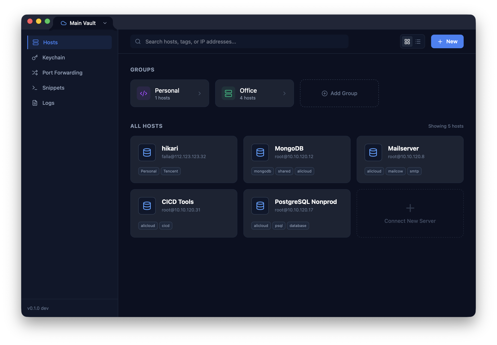

# SwiftSSH



A lightweight, cross-platform desktop SSH client for managing SSH host profiles, storing private keys securely, and running multiple interactive terminal and SFTP sessions — all from a clean, dark-themed interface.

    

---

## Features

- **SSH Connection Manager** — Add, edit, and organize host profiles into color-coded groups.
- **Host Grouping** — Organize servers into logical folders/groups with custom colors and icons.
- **Dashboard View Modes** — Switch between Grid and List views with persistent preferences.
- **Password & Key Auth** — Connect using a password or an imported SSH private key (RSA, Ed25519, ECDSA).
- **Interactive Terminal** — Fully interactive xterm.js terminal with real-time I/O, cursor blinking, scrollback, and 256-color support.
- **Terminal Theming** — Multiple built-in terminal themes (Dracula, SwiftSSH Dark, etc.) with custom font settings.
- **Tabbed Sessions** — Open multiple simultaneous SSH connections with tab management (Duplicate, Rename, Close).
- **SFTP File Browser** — Browse remote file systems, transfer files, and manage a transfer queue alongside terminal sessions.
- **SSH Key Manager (Keychain)** — Dedicated interface for managing SSH keys with fingerprinting support.
- **Secure Vault** — Master-password-protected encrypted storage for credentials using AES-GCM + Argon2 KDF.
- **Command Snippets** — Save and manage reusable command snippets for quick execution.
- **Port Forwarding** — Configure local and remote port forwarding rules with persistence.
- **Jump Host / Multi-hop** — Connect through bastion hosts with jump host support.
- **Agent Forwarding** — Forward your local SSH agent to remote hosts.
- **Activity Logging** — Categorized event tracking with a dedicated log viewer screen.
- **Distro Detection** — Automatic mascot assignment (Ubuntu, Debian, CentOS, etc.) based on host metadata.
- **Settings** — Configurable SSH/SFTP behavior and terminal preferences.
- **Persistent Storage** — All hosts, groups, keys, and settings are saved locally and persist across restarts.

---

## Tech Stack

| Layer             | Technology                                                              |
| :---------------- | :---------------------------------------------------------------------- |
| Desktop framework | [Tauri v2](https://v2.tauri.app) (Rust)                                 |
| Frontend          | [React 19](https://react.dev) + TypeScript + [Vite 6](https://vite.dev) |
| Styling           | [Tailwind CSS v4](https://tailwindcss.com)                              |
| State management  | [Zustand](https://zustand.docs.pmnd.rs)                                 |
| Terminal emulator | [xterm.js v6](https://xtermjs.org)                                      |
| SSH/SFTP backend  | Python 3 sidecar using [Paramiko](https://www.paramiko.org)             |
| Encryption        | AES-GCM 256-bit + Argon2 KDF (Rust)                                     |
| Storage           | JSON files + encrypted vault                                            |

---

## Prerequisites

Make sure these are installed before getting started:

| Tool       | Minimum version | Install                              |
| :--------- | :-------------- | :----------------------------------- |
| **Bun**    | 1.0+            | [bun.sh](https://bun.sh)             |
| **Rust**   | 1.70+           | [rustup.rs](https://rustup.rs)       |
| **Python** | 3.10+           | [python.org](https://www.python.org) |

### macOS-specific

Xcode Command Line Tools are required for Tauri to compile native code:

```bash
xcode-select --install
```

### Linux-specific

Install the system libraries Tauri depends on (Debian/Ubuntu):

```bash
sudo apt update
sudo apt install -y libwebkit2gtk-4.1-dev build-essential curl wget file \
  libssl-dev libgtk-3-dev libayatana-appindicator3-dev librsvg2-dev
```

---

## Quick Start

### 1. Clone the repository

```bash
git clone https://github.com/your-username/SwiftSSH.git
cd SwiftSSH
```

### 2. Install dependencies

```bash
# Node dependencies
bun install

# Python dependencies
pip3 install -r sidecar/requirements.txt
```

### 3. Run in development mode

```bash
bun run tauri dev
```

This will:

1. Start the Vite dev server on `http://localhost:1420`
2. Compile the Rust backend
3. Launch the native SwiftSSH window with hot-reload enabled

### 4. Build for production

```bash
bun run tauri build
```

The compiled binary and installer will be in `src-tauri/target/release/bundle/`.

---

## Project Structure

```text
SwiftSSH/
├── src-tauri/                  # Tauri v2 Rust shell
│   ├── src/
│   │   ├── main.rs             # Application entry point
│   │   ├── lib.rs              # IPC command handlers (host/key CRUD, SSH/SFTP mgmt)
│   │   ├── ssh_bridge.rs       # Spawns Python sidecar processes, manages SSH sessions
│   │   ├── sftp_bridge.rs      # SFTP operations bridge
│   │   ├── secure_storage.rs   # Encrypted vault for credentials
│   │   └── crypto.rs           # AES-GCM + Argon2 encryption utilities
│   ├── icons/                  # App icons for bundling
│   ├── Cargo.toml              # Rust dependencies
│   └── tauri.conf.json         # Tauri configuration (main + settings windows)
│
├── sidecar/                    # Python SSH/SFTP backend
│   ├── main.py                 # Paramiko-based interactive SSH session manager
│   ├── sftp.py                 # SFTP file operations
│   └── requirements.txt        # Python dependencies
│
├── src/                        # React + TypeScript frontend
│   ├── components/
│   │   ├── Sidebar.tsx         # Left sidebar with navigation
│   │   ├── HostList.tsx        # Saved hosts list with connect/edit/delete actions
│   │   ├── AddHostModal.tsx    # Modal dialog for adding or editing a host profile
│   │   ├── KeyManager.tsx      # SSH key management (add/import/delete keys)
│   │   ├── TerminalTab.tsx     # xterm.js terminal instance per SSH session
│   │   ├── SftpPane.tsx        # SFTP file browser panel
│   │   ├── SnippetsScreen.tsx  # Command snippets manager
│   │   ├── SettingsScreen.tsx  # SSH/SFTP and terminal settings
│   │   ├── ActivityLogScreen.tsx # Activity log viewer
│   │   └── ...                 # Additional UI components
│   ├── store/
│   │   └── useStore.ts         # Zustand global state (hosts, keys, tabs, settings)
│   ├── lib/
│   │   ├── terminalManager.ts  # Terminal instance lifecycle management
│   │   └── activityLogger.ts   # Activity event logging service
│   ├── utils/
│   │   ├── sftpClient.ts       # SFTP operations wrapper
│   │   ├── distroIcons.ts      # Distro mascot icon mapping
│   │   └── fileIcons.ts        # File type icon mapping
│   ├── assets/                 # Distro mascot images
│   ├── App.tsx                 # Root layout — sidebar, tab bar, terminal area
│   ├── index.css               # Tailwind imports, dark theme, custom scrollbars
│   └── main.tsx                # React DOM entry point
│
├── index.html                  # HTML shell
├── package.json
├── tsconfig.json
├── vite.config.ts
└── .gitignore
```

---

## Architecture

### Data Flow

```text
┌─────────────────────────────────────────────────────────────┐
│  Frontend (React + xterm.js)                                │
│                                                             │
│  HostList ──invoke──► save_host / delete_host / list_hosts  │
│  KeyManager ──invoke──► save_key / delete_key / list_keys   │
│  HostList ──invoke──► connect_host ──► returns session_id   │
│  TerminalTab ──invoke──► send_input(session_id, data)       │
│  TerminalTab ◄──listen── "ssh-output" event                 │
│  SftpPane ──invoke──► sftp_list / sftp_upload / sftp_download│
│  App ◄──listen── "ssh-disconnected" event                   │
└────────────────────────┬────────────────────────────────────┘
                         │ Tauri IPC (invoke / events)
┌────────────────────────▼────────────────────────────────────┐
│  Rust Backend (src-tauri)                                   │
│                                                             │
│  lib.rs ── CRUD commands, vault operations                  │
│  ssh_bridge.rs ── spawns python3 sidecar/main.py per conn   │
│  sftp_bridge.rs ── spawns python3 sidecar/sftp.py           │
│  secure_storage.rs ── encrypted credential vault            │
│  crypto.rs ── AES-GCM encryption with Argon2 key derivation │
└────────────────────────┬────────────────────────────────────┘
                         │ subprocess (stdin/stdout)
┌────────────────────────▼────────────────────────────────────┐
│  Python Sidecar                                             │
│                                                             │
│  main.py ── SSH sessions via Paramiko (password or key auth)│
│  sftp.py ── SFTP file operations via Paramiko               │
└─────────────────────────────────────────────────────────────┘
```

---

## Storage

All data is stored in your OS local data directory:

| OS      | Path                                      |
| :------ | :---------------------------------------- |
| macOS   | `~/Library/Application Support/SwiftSSH/` |
| Linux   | `~/.local/share/SwiftSSH/`                |
| Windows | `C:\Users\<user>\AppData\Local\SwiftSSH\` |

**Files:**

- `hosts.json` — Array of host profile objects
- `keys.json` — Array of SSH key objects
- `vault.json` — Encrypted credential store (AES-GCM protected)

Sensitive data (passwords, private keys) is encrypted at rest in the vault using a master password with Argon2 key derivation.

---

## Development

### Frontend only (no Tauri)

```bash
bun run dev
```

Opens the Vite dev server at `http://localhost:1420`. Useful for iterating on UI without recompiling Rust. Note: Tauri `invoke` calls will fail in the browser.

### Rust changes

Changes to `src-tauri/src/` are automatically detected and recompiled when running `bun run tauri dev`.

### Python sidecar changes

The Python sidecar is spawned fresh for each connection, so changes to `sidecar/main.py` or `sidecar/sftp.py` take effect on the next connection without restarting the app.

---

## License

MIT
